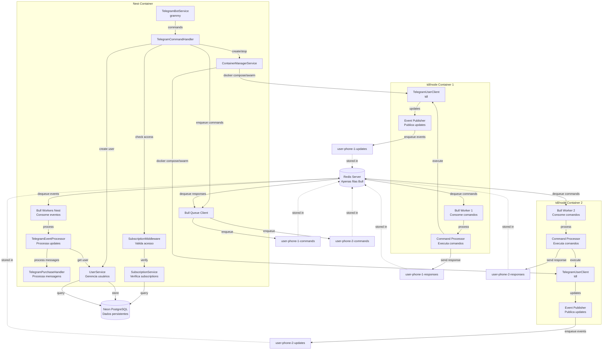

# Plano de Migração para Arquitetura Multi-Container

## Visão Geral da Arquitetura

### Arquitetura Atual

- **Monolítica**: Tudo roda no mesmo processo NestJS
- **TelegramUserClient singleton**: Um único cliente tdl compartilhado
- **Filas em memória**: `QueueInMemory` para processamento de mensagens
- **Persistência em memória**: `ActiveGroupsStore` e `ConversationStateService`

### Arquitetura Alvo



## Componentes Principais

### 1. Nest Container (Aplicação Principal)

- **TelegramBotService**: Mantém grammy bot para comandos
- **TelegramCommandHandler**: Processa comandos do bot
- **ContainerManagerService**: Gerencia ciclo de vida dos containers tdl/node
- **Bull Queue Client**: Enfileira comandos e consome respostas dos containers tdl/node
- **Bull Worker Nest**: Consome eventos/updates publicados pelos containers tdl/node
- **TelegramEventProcessor**: Processa eventos recebidos dos containers tdl/node (updates, mensagens, etc)
- **TelegramPurchaseHandler**: Processa mensagens recebidas (parsing, cálculo de preços) - **permanece no Nest**
- **UserService**: Gerencia usuários, cria na primeira interação com o bot, mantém mapeamento `phoneNumber → userId`
- **SubscriptionService**: Verifica subscriptions e limita funcionalidades disponíveis
- **SubscriptionMiddleware**: Middleware que valida acesso antes de processar comandos
- **Database Service**: Acesso ao Neon PostgreSQL via TypeORM
- **Redis Client**: Conexão com Redis **apenas para filas Bull** (não para persistência de dados)

### 2. tdl/node Container (Por Usuário)

- **TelegramUserClient**: Cliente tdl isolado por usuário
- **Command Processor**: Processa comandos recebidos do Nest e executa via TelegramUserClient
- **Bull Worker**: Consome filas de comandos do Redis (Nest → tdl)
- **Event Publisher**: Publica eventos/updates do Telegram para o Nest container (tdl → Nest)
- **Response Publisher**: Publica respostas de comandos síncronos para o Nest container
- **Volume persistente**: Armazena databaseDirectory e filesDirectory

### 3. Redis/Bull

- **Uso exclusivo para filas**: Redis é usado **apenas** para filas Bull, não para persistência de dados
- **Filas de comandos por usuário**: Uma fila `user-{phoneNumber}-commands` por phone number (Nest → tdl)
- **Filas de respostas por usuário**: Uma fila `user-{phoneNumber}-responses` por phone number (tdl → Nest)
- **Filas de eventos por usuário**: Uma fila `user-{phoneNumber}-updates` por phone number (tdl → Nest)
- **Comunicação bidirecional**: 
  - **Nest → tdl**: Comandos e ações via filas específicas por usuário
  - **tdl → Nest**: Respostas de comandos e eventos via filas específicas por usuário

### 4. Neon PostgreSQL (Banco de Dados SQL)

- **Fonte de verdade para dados persistentes**: Todos os dados persistentes são armazenados no Neon PostgreSQL
- **Acesso exclusivo pelo Nest container**: Apenas o Nest container acessa o banco diretamente
- **Dados armazenados**:
  - **Usuários**: Informações de usuários, mapeamento `phoneNumber → userId`, dados do Telegram
  - **Subscriptions**: Planos de assinatura, limites de funcionalidades, status de pagamento
  - **Active Groups**: Grupos ativos por usuário (migrado do Redis)
  - **Logs/Auditoria**: Histórico de ações, eventos importantes
- **ORM**: TypeORM para acesso ao banco de dados
- **Migrations**: Controle de versão do schema via TypeORM migrations

## Estrutura de Arquivos a Criar/Modificar

### Novos Arquivos

#### Nest Container

- `src/infrastructure/container/container-manager.service.ts` - Gerencia containers Docker
- `src/infrastructure/queue/bull-queue.service.ts` - Cliente Bull para enfileirar mensagens
- `src/infrastructure/queue/interfaces/queue-client.interface.ts` - Interface para abstração de filas
- `src/infrastructure/queue/bull-event-worker.service.ts` - Worker Bull para consumir eventos dos containers tdl/node
- `src/infrastructure/queue/bull-response-consumer.service.ts` - Consome respostas de comandos dos containers tdl/node
- `src/infrastructure/telegram/telegram-event-processor.service.ts` - Processa eventos recebidos dos containers tdl/node
- `src/infrastructure/telegram/telegram-user-client-proxy.service.ts` - Proxy para comunicação com containers tdl/node (com callbacks para respostas)
- `src/infrastructure/database/database.module.ts` - Módulo de configuração do TypeORM
- `src/infrastructure/database/entities/user.entity.ts` - Entidade User
- `src/infrastructure/database/entities/subscription.entity.ts` - Entidade Subscription
- `src/infrastructure/database/entities/active-group.entity.ts` - Entidade ActiveGroup
- `src/infrastructure/database/repositories/user.repository.ts` - Repositório de usuários
- `src/infrastructure/database/repositories/subscription.repository.ts` - Repositório de subscriptions
- `src/infrastructure/database/repositories/active-group.repository.ts` - Repositório de grupos ativos
- `src/infrastructure/users/user.service.ts` - Serviço para gerenciar usuários
- `src/infrastructure/subscriptions/subscription.service.ts` - Serviço para verificar subscriptions
- `src/infrastructure/subscriptions/subscription.middleware.ts` - Middleware para validar acesso
- `src/infrastructure/subscriptions/subscription.guard.ts` - Guard para proteger rotas/comandos
- `docker-compose.yml` - Configuração para ambiente local
- `docker-compose.prod.yml` - Configuração para Docker Swarm
- `Dockerfile.nest` - Dockerfile para container Nest
- `Dockerfile.tdl` - Dockerfile para container tdl/node

#### tdl/node Container

- `tdl-container/src/main.ts` - Entry point do container tdl/node
- `tdl-container/src/telegram-client.service.ts` - Cliente Telegram isolado
- `tdl-container/src/command-processor.service.ts` - Processa comandos recebidos do Nest e executa via TelegramUserClient
- `tdl-container/src/bull-worker.service.ts` - Worker Bull para consumir filas de comandos (Nest → tdl)
- `tdl-container/src/event-publisher.service.ts` - Publica eventos/updates do Telegram para o Nest container
- `tdl-container/src/response-publisher.service.ts` - Publica respostas de comandos síncronos para o Nest container
- `tdl-container/src/telegram-update-handler.service.ts` - Handler que captura updates do TelegramUserClient e os publica
- `tdl-container/package.json` - Dependências do container tdl/node
- `tdl-container/Dockerfile` - Dockerfile específico

### Arquivos a Modificar

#### Nest Container

- `src/infrastructure/infrastructure.module.ts` - Adicionar novos providers
- `src/infrastructure/telegram/telegram-bot-command.handler.ts` - Usar ContainerManagerService e Bull
- `src/infrastructure/telegram/telegram-user-login-handler.ts` - Criar container no login
- `src/infrastructure/telegram/telegram-user-message-processor.ts` - Adaptar para processar eventos recebidos dos containers tdl/node (não remover)
- `src/infrastructure/telegram/telegram-queue-processor.service.ts` - Substituir por Bull
- `src/infrastructure/telegram/telegram-user-handler.ts` - Remover (movido para tdl container)
- `src/infrastructure/telegram/telegram-user-client.ts` - Manter apenas como referência ou remover
- `src/infrastructure/persistence/persistence.module.ts` - Migrar `ActiveGroupsRepository` para SQL (implementação via TypeORM)
- `package.json` - Adicionar `@nestjs/bull`, `bull`, `ioredis`, `dockerode`, `@nestjs/typeorm`, `typeorm`, `pg`
- `src/config/app.config.ts` - Adicionar configurações Redis, Docker e Neon PostgreSQL
- `src/infrastructure/database/migrations/` - Migrations do TypeORM para criar tabelas

## Estratégia de Migração

### Fase 1: Preparação da Infraestrutura

1. Adicionar dependências Redis/Bull ao Nest container
2. Adicionar dependências TypeORM e PostgreSQL (pg) para Neon
3. Criar interface de abstração para filas (`QueueClient`)
4. Configurar conexão Redis no Nest container (apenas para filas Bull)
5. Configurar conexão Neon PostgreSQL no Nest container (TypeORM)
6. Criar `BullQueueService` como implementação de `QueueClient`
7. Criar `DatabaseModule` com configuração TypeORM

### Fase 2: Container Manager

1. Criar `ContainerManagerService` com métodos:

   - `createContainer(phoneNumber: string)`: Cria container tdl/node
   - `stopContainer(phoneNumber: string)`: Para container
   - `getContainerStatus(phoneNumber: string)`: Verifica status
   - `listContainers()`: Lista containers ativos

2. Implementar integração com Docker Compose (local) e Docker Swarm (prod)
3. Gerenciar volumes Docker por usuário

### Fase 3: tdl/node Container

1. Criar estrutura básica do container tdl/node
2. Implementar `TelegramClientService` isolado
3. Implementar `BullWorkerService` para consumir filas de comandos
4. Implementar `CommandProcessorService` para executar comandos recebidos
5. Implementar `ResponsePublisherService` para publicar respostas de comandos síncronos
6. Implementar `EventPublisherService` para publicar eventos/updates
7. Configurar volumes para persistência de dados

### Fase 4: Comunicação via Bull

1. Definir estrutura de mensagens para filas:

   - **Filas de comandos** (`user-{phoneNumber}-commands`): Comandos do Nest para tdl
     - Login, logout, getChats, getChat, sendMessage, getMe, getUserId, etc.
   - **Filas de respostas** (`user-{phoneNumber}-responses`): Respostas de comandos síncronos (tdl → Nest)
     - Resultados de getChats, getChat, getMe, etc.
   - **Filas de eventos** (`user-{phoneNumber}-updates`): Updates do tdl para Nest (por usuário)
     - updateNewMessage, updateConnectionState, updateAuthorizationState, waitingAuthCode, etc.

2. Implementar serialização/deserialização de mensagens
3. Criar handlers para diferentes tipos de mensagens
4. **No tdl container**: 
   - Implementar `EventPublisherService` que escuta updates do TelegramUserClient e os enfileira
   - Implementar `ResponsePublisherService` que publica respostas de comandos síncronos
5. **No Nest container**: 
   - Implementar `BullEventWorkerService` que consome filas de eventos por usuário
   - Implementar `BullResponseConsumerService` que consome filas de respostas e resolve callbacks
   - Implementar `TelegramEventProcessor` que roteia eventos para handlers apropriados
6. **Implementar sistema de callbacks**: Para comandos síncronos, usar Map de promises pendentes identificadas por requestId

### Fase 5: Migração de Handlers

1. Modificar `TelegramCommandHandler` para usar `ContainerManagerService`
2. **Integrar `SubscriptionMiddleware`**: Adicionar verificação de subscription antes de processar comandos
3. **Integrar `UserService`**: Criar/obter usuário na primeira interação com o bot
4. Substituir chamadas diretas ao `TelegramUserClient` por enfileiramento via Bull com callbacks
5. Criar `TelegramUserClientProxyService` que enfileira comandos e aguarda respostas via callbacks
6. **Adaptar `TelegramUserMessageProcessor`**: Modificar para processar eventos `updateNewMessage` recebidos dos containers tdl/node (não remover)
7. **Criar handlers de eventos no Nest**: Implementar handlers para processar eventos recebidos dos containers tdl/node
   - Handler para `updateNewMessage`: Processar novas mensagens recebidas e acionar `TelegramPurchaseHandler`
   - Handler para `updateConnectionState`: Monitorar estado de conexão
   - Handler para `updateAuthorizationState`: Monitorar estado de autorização
   - Handler para `waitingAuthCode`: Solicitar código via bot e enviar via fila de comandos
8. **Implementar fluxo de login via fila**: 
   - Container tdl/node envia evento `waitingAuthCode`
   - Nest recebe e solicita código via bot Telegram
   - Nest envia código via fila de comandos `user-{phoneNumber}-commands`
   - Container tdl/node completa login
9. **Substituir `UserMappingService` por `UserService`**: Usar banco de dados SQL para mapeamento `phoneNumber → userId`

### Fase 6: Persistência e Banco de Dados

1. **Criar estrutura de banco de dados no Neon PostgreSQL**:
   - Definir entidades TypeORM: `User`, `Subscription`, `ActiveGroup`
   - Criar migrations para criar tabelas
   - Configurar relacionamentos entre entidades

2. **Implementar `UserService`**:
   - Criar usuário na primeira interação com o bot (`on-bot-interaction`)
   - Manter mapeamento `phoneNumber → userId` no banco
   - Gerenciar informações do usuário (Telegram ID, phone number, etc.)

3. **Implementar `SubscriptionService`**:
   - Verificar subscription do usuário
   - Definir limites de funcionalidades por tipo de subscription
   - Cache de subscriptions para performance (atualização periódica)

4. **Migrar `ActiveGroupsRepository` para SQL**:
   - Criar implementação `SqlActiveGroupsRepository` usando TypeORM
   - Manter interface `ActiveGroupsRepository` para compatibilidade
   - Usar `userId` como chave (obtido via `UserService`)

5. **Implementar `SubscriptionMiddleware`**:
   - Verificar subscription antes de processar comandos
   - Bloquear comandos não permitidos para o tipo de subscription
   - Retornar mensagem apropriada ao usuário

6. Manter `ConversationStateService` no Nest container (estado do bot - não precisa ser compartilhado)

7. Configurar volumes Docker para persistência de dados tdl (databaseDirectory e filesDirectory)

8. **Configurar conexão Neon PostgreSQL**:
   - Variáveis de ambiente para conexão
   - Pool de conexões configurado adequadamente
   - Retry logic para reconexão automática

### Fase 7: Docker Compose/Swarm

1. Criar `docker-compose.yml` para ambiente local
2. Criar `docker-compose.prod.yml` para Docker Swarm
3. Configurar networks, volumes e dependências
4. Criar scripts de deploy

### Fase 8: Testes e Validação

1. Testar criação/destruição de containers
2. Testar comunicação via Bull queues (Nest → tdl)
3. Testar publicação e consumo de eventos (tdl → Nest)
4. Testar persistência de dados em volumes
5. Validar isolamento entre usuários
6. Testar processamento de eventos em diferentes cenários (mensagens, conexão, autorização)
7. Validar que eventos são processados corretamente mesmo com múltiplos containers ativos
8. Testar resiliência: containers desconectados não devem gerar erros no Nest container

## Fluxo de Comunicação Bidirecional

### Nest → tdl (Comandos)

1. Usuário envia comando via bot Telegram (`/grupos`, `/ativar`, etc.)
2. `TelegramCommandHandler` processa o comando
3. `TelegramUserClientProxyService` enfileira comando na fila `user-{phoneNumber}-commands` com `requestId`
4. Para comandos síncronos: cria Promise pendente identificada por `requestId`
5. Bull Worker no container tdl/node consome o comando
6. `CommandProcessor` no container executa o comando via `TelegramUserClient`
7. **Para comandos síncronos**: `ResponsePublisher` enfileira resposta na fila `user-{phoneNumber}-responses`
8. **No Nest**: `BullResponseConsumer` consome resposta e resolve Promise pendente
9. `TelegramCommandHandler` recebe resultado e responde ao usuário via bot

### tdl → Nest (Eventos/Updates)

1. `TelegramUserClient` no container tdl/node recebe update do Telegram (nova mensagem, mudança de estado, etc.)
2. `TelegramUpdateHandler` captura o update e o encaminha para `EventPublisherService`
3. `EventPublisherService` enfileira o evento na fila `user-{phoneNumber}-updates` com `phoneNumber` identificador
4. Bull Worker no Nest container consome eventos da fila específica do usuário
5. `TelegramEventProcessor` processa o evento e roteia para handler apropriado:
   - `updateNewMessage` → Extrai mensagem e aciona `TelegramPurchaseHandler` (que usa serviços do domínio)
   - `updateConnectionState` → Atualiza estado de conexão do usuário
   - `updateAuthorizationState` → Atualiza estado de autorização
   - `waitingAuthCode` → Solicita código via bot e envia via fila de comandos
6. Handlers podem notificar o bot Telegram ou atualizar estado interno
7. **Processamento de mensagens permanece no Nest**: `TelegramPurchaseHandler` usa `MessageParser`, `PriceTableProvider`, etc. do domínio

## Estrutura de Banco de Dados (Neon PostgreSQL)

### Entidades Principais

```typescript
// User Entity
@Entity('users')
class User {
  @PrimaryGeneratedColumn('uuid')
  id: string;

  @Column({ unique: true })
  telegramUserId: number; // ID do usuário no bot Telegram

  @Column({ unique: true })
  phoneNumber: string; // Número de telefone (chave para mapeamento)

  @Column({ nullable: true })
  telegramUserClientId: number; // ID do usuário no Telegram (após login)

  @Column({ nullable: true })
  firstName: string;

  @Column({ nullable: true })
  lastName: string;

  @Column({ nullable: true })
  username: string;

  @OneToOne(() => Subscription, subscription => subscription.user)
  subscription: Subscription;

  @OneToMany(() => ActiveGroup, group => group.user)
  activeGroups: ActiveGroup[];

  @CreateDateColumn()
  createdAt: Date;

  @UpdateDateColumn()
  updatedAt: Date;
}

// Subscription Entity
@Entity('subscriptions')
class Subscription {
  @PrimaryGeneratedColumn('uuid')
  id: string;

  @OneToOne(() => User, user => user.subscription)
  @JoinColumn()
  user: User;

  @Column()
  plan: 'free' | 'basic' | 'premium'; // Tipos de plano

  @Column({ type: 'jsonb', nullable: true })
  features: {
    maxActiveGroups?: number;
    canUseAdvancedFeatures?: boolean;
    // ... outros limites de funcionalidades
  };

  @Column({ nullable: true })
  expiresAt: Date;

  @Column({ default: true })
  isActive: boolean;

  @CreateDateColumn()
  createdAt: Date;

  @UpdateDateColumn()
  updatedAt: Date;
}

// ActiveGroup Entity
@Entity('active_groups')
class ActiveGroup {
  @PrimaryGeneratedColumn('uuid')
  id: string;

  @ManyToOne(() => User, user => user.activeGroups)
  user: User;

  @Column()
  groupId: number; // ID do grupo no Telegram

  @Column({ nullable: true })
  groupTitle: string;

  @CreateDateColumn()
  createdAt: Date;

  @UpdateDateColumn()
  updatedAt: Date;

  @Index(['user', 'groupId'], { unique: true })
  uniqueUserGroup: string;
}
```

### Limites por Tipo de Subscription

```typescript
const SUBSCRIPTION_LIMITS = {
  free: {
    maxActiveGroups: 1,
    canUseAdvancedFeatures: false,
    canCreateContainer: false, // Não pode criar container tdl/node
  },
  basic: {
    maxActiveGroups: 5,
    canUseAdvancedFeatures: true,
    canCreateContainer: true,
  },
  premium: {
    maxActiveGroups: -1, // Ilimitado
    canUseAdvancedFeatures: true,
    canCreateContainer: true,
  },
};
```

## Detalhes de Implementação

### ContainerManagerService

```typescript
// Estrutura básica
class ContainerManagerService {
  async createContainer(phoneNumber: string): Promise<void>
  async stopContainer(phoneNumber: string): Promise<void>
  async getContainerStatus(phoneNumber: string): Promise<ContainerStatus>
  private getContainerName(phoneNumber: string): string
  private getVolumeName(phoneNumber: string): string
}
```

### Estrutura de Mensagens Bull

```typescript
// Comando do Nest para tdl (fila: user-{phoneNumber}-commands)
interface CommandMessage {
  type: 'login' | 'logout' | 'getChats' | 'getChat' | 'sendMessage' | 'getMe' | 'getUserId' | ...
  payload: unknown
  requestId: string
  phoneNumber: string
}

// Evento/Update do tdl para Nest (fila: user-{phoneNumber}-updates)
interface UpdateMessage {
  type: 'updateNewMessage' | 'updateConnectionState' | 'updateAuthorizationState' | 'waitingAuthCode' | ...
  payload: unknown
  phoneNumber: string
  timestamp: number
  containerId?: string // Identificador do container que gerou o evento
}

// Resposta de comando (fila: user-{phoneNumber}-responses)
interface CommandResponse {
  requestId: string
  success: boolean
  data?: unknown
  error?: string
  phoneNumber: string
  timestamp: number
}
```

### Volume Mapping

```
/user-data/{phoneNumber}/database -> databaseDirectory
/user-data/{phoneNumber}/files -> filesDirectory
```

### EventPublisherService (tdl container)

```typescript
// No container tdl/node
class EventPublisherService {
  constructor(
    @InjectQueue(`user-${phoneNumber}-updates`) private readonly updatesQueue: Queue<UpdateMessage>,
    private readonly phoneNumber: string
  ) {}

  async publishUpdate(update: unknown): Promise<void> {
    const updateMessage: UpdateMessage = {
      type: this.extractUpdateType(update),
      payload: update,
      phoneNumber: this.phoneNumber,
      timestamp: Date.now(),
      containerId: process.env.CONTAINER_ID
    };
    
    await this.updatesQueue.add(updateMessage.type, updateMessage);
  }
  
  private extractUpdateType(update: unknown): string {
    // Extrai o tipo do update do objeto Telegram
    if (typeof update === 'object' && update !== null && '_' in update) {
      return (update as { _: string })._;
    }
    return 'unknown';
  }
}
```

### ResponsePublisherService (tdl container)

```typescript
// No container tdl/node
class ResponsePublisherService {
  constructor(
    @InjectQueue(`user-${phoneNumber}-responses`) private readonly responsesQueue: Queue<CommandResponse>,
    private readonly phoneNumber: string
  ) {}

  async publishResponse(requestId: string, data: unknown): Promise<void> {
    const response: CommandResponse = {
      requestId,
      success: true,
      data,
      phoneNumber: this.phoneNumber,
      timestamp: Date.now()
    };
    
    await this.responsesQueue.add(response);
  }

  async publishError(requestId: string, error: string): Promise<void> {
    const response: CommandResponse = {
      requestId,
      success: false,
      error,
      phoneNumber: this.phoneNumber,
      timestamp: Date.now()
    };
    
    await this.responsesQueue.add(response);
  }
}
```

### TelegramEventProcessor (Nest container)

```typescript
// No Nest container
// Processa eventos de múltiplas filas (uma por usuário)
class TelegramEventProcessor {
  constructor(
    private readonly purchaseHandler: TelegramPurchaseHandler,
    private readonly activeGroupsRepository: ActiveGroupsRepository,
    private readonly userMapping: UserMappingService,
    private readonly authCodeService: AuthCodeService,
    private readonly commandProxy: TelegramUserClientProxyService
  ) {}

  @Process({ name: 'updateNewMessage', queue: 'user-*-updates' })
  async handleNewMessage(job: Job<UpdateMessage>): Promise<void> {
    const { payload, phoneNumber } = job.data;
    
    // Mapeia phoneNumber para userId
    const userId = await this.userMapping.getUserId(phoneNumber);
    if (!userId) {
      console.warn(`[${phoneNumber}] User ID not found, skipping message`);
      return;
    }

    const message = payload.message;
    if (!message) return;

    // Verifica grupos ativos (usa userId)
    const activeGroups = await this.activeGroupsRepository.getActiveGroups(userId.toString());
    if (!activeGroups || !activeGroups.includes(message.chat_id)) {
      return; // Grupo não ativo
    }

    // Extrai texto da mensagem
    const text = this.extractText(message);
    if (text) {
      // Processa mensagem com TelegramPurchaseHandler (usa serviços do domínio)
      await this.purchaseHandler.handlePurchase(
        message.chat_id,
        message.id,
        text
      );
    }
  }

  @Process({ name: 'waitingAuthCode', queue: 'user-*-updates' })
  async handleWaitingAuthCode(job: Job<UpdateMessage>): Promise<void> {
    const { payload, phoneNumber } = job.data;
    
    // Mapeia phoneNumber para userId do bot
    const userId = await this.userMapping.getUserId(phoneNumber);
    if (!userId) {
      console.warn(`[${phoneNumber}] User ID not found for auth code`);
      return;
    }

    // Solicita código via bot Telegram
    await this.authCodeService.requestAuthCode(userId, phoneNumber);
    
    // Quando código for recebido, enviar via fila de comandos
    // (implementado em AuthCodeService)
  }

  @Process({ name: 'updateConnectionState', queue: 'user-*-updates' })
  async handleConnectionState(job: Job<UpdateMessage>): Promise<void> {
    const { payload, phoneNumber } = job.data;
    console.log(`[${phoneNumber}] Connection state:`, payload.state);
  }

  @Process({ name: 'updateAuthorizationState', queue: 'user-*-updates' })
  async handleAuthorizationState(job: Job<UpdateMessage>): Promise<void> {
    const { payload, phoneNumber } = job.data;
    console.log(`[${phoneNumber}] Authorization state:`, payload.state);
  }

  private extractText(message: unknown): string | null {
    // Extrai texto da mensagem (similar ao código atual)
    // ...
  }
}
```

### TelegramUserClientProxyService (Nest container)

```typescript
// No Nest container
@Injectable()
class TelegramUserClientProxyService {
  private readonly pendingRequests = new Map<string, {
    resolve: (data: unknown) => void;
    reject: (error: Error) => void;
    timeout: NodeJS.Timeout;
  }>();

  constructor(
    @InjectQueue('user-*-commands') private readonly commandsQueue: Queue,
    @InjectQueue('user-*-responses') private readonly responsesQueue: Queue,
    private readonly responseConsumer: BullResponseConsumerService
  ) {}

  async executeCommand<T>(
    phoneNumber: string,
    type: string,
    payload: unknown,
    timeout = 30000
  ): Promise<T> {
    const requestId = `${phoneNumber}-${Date.now()}-${Math.random()}`;
    
    return new Promise<T>((resolve, reject) => {
      // Registra promise pendente
      const timeoutHandle = setTimeout(() => {
        this.pendingRequests.delete(requestId);
        reject(new Error('Command timeout'));
      }, timeout);

      this.pendingRequests.set(requestId, {
        resolve: (data) => {
          clearTimeout(timeoutHandle);
          resolve(data as T);
        },
        reject: (error) => {
          clearTimeout(timeoutHandle);
          reject(error);
        },
        timeout: timeoutHandle
      });

      // Enfileira comando
      this.commandsQueue.add(`user-${phoneNumber}-commands`, {
        type,
        payload,
        requestId,
        phoneNumber
      });
    });
  }

  // Chamado pelo BullResponseConsumer quando recebe resposta
  resolveResponse(requestId: string, response: CommandResponse): void {
    const pending = this.pendingRequests.get(requestId);
    if (pending) {
      this.pendingRequests.delete(requestId);
      if (response.success) {
        pending.resolve(response.data);
      } else {
        pending.reject(new Error(response.error || 'Command failed'));
      }
    }
  }
}
```

### BullEventWorkerService (Nest container)

```typescript
// No Nest container
@Injectable()
class BullEventWorkerService implements OnModuleInit {
  constructor(
    private readonly bullModule: BullModule,
    private readonly eventProcessor: TelegramEventProcessor
  ) {}

  async onModuleInit(): Promise<void> {
    // Registra workers dinamicamente para cada fila de usuário ativo
    // Workers são criados via @Processor decorator com pattern matching
    // 'user-*-updates' para consumir todas as filas de eventos
  }
}
```

### BullResponseConsumerService (Nest container)

```typescript
// No Nest container
@Processor({ name: '*', queue: 'user-*-responses' })
class BullResponseConsumerService {
  constructor(
    private readonly proxyService: TelegramUserClientProxyService
  ) {}

  @Process('*')
  async handleResponse(job: Job<CommandResponse>): Promise<void> {
    const response = job.data;
    // Resolve promise pendente no proxy service
    this.proxyService.resolveResponse(response.requestId, response);
  }
}
```

### UserService (Nest container)

```typescript
// No Nest container
@Injectable()
class UserService {
  constructor(
    @InjectRepository(User)
    private readonly userRepository: Repository<User>
  ) {}

  async getOrCreateUser(telegramUserId: number, phoneNumber?: string): Promise<User> {
    // Busca por telegramUserId primeiro
    let user = await this.userRepository.findOne({
      where: { telegramUserId },
      relations: ['subscription', 'activeGroups']
    });

    if (!user && phoneNumber) {
      // Se não encontrou e tem phoneNumber, busca por phoneNumber
      user = await this.userRepository.findOne({
        where: { phoneNumber },
        relations: ['subscription', 'activeGroups']
      });
    }

    if (!user) {
      // Cria novo usuário na primeira interação com o bot
      user = this.userRepository.create({
        telegramUserId,
        phoneNumber: phoneNumber || null,
      });
      user = await this.userRepository.save(user);

      // Cria subscription padrão (free)
      const subscription = this.subscriptionRepository.create({
        user,
        plan: 'free',
        features: SUBSCRIPTION_LIMITS.free,
        isActive: true,
      });
      await this.subscriptionRepository.save(subscription);
    }

    return user;
  }

  async updateUserMapping(userId: string, phoneNumber: string, telegramUserClientId: number): Promise<void> {
    await this.userRepository.update(
      { id: userId },
      { phoneNumber, telegramUserClientId }
    );
  }

  async getUserIdByPhoneNumber(phoneNumber: string): Promise<number | null> {
    const user = await this.userRepository.findOne({
      where: { phoneNumber },
    });
    return user ? user.telegramUserId : null;
  }

  async getPhoneNumberByUserId(telegramUserId: number): Promise<string | null> {
    const user = await this.userRepository.findOne({
      where: { telegramUserId },
    });
    return user?.phoneNumber || null;
  }
}
```

### SubscriptionService (Nest container)

```typescript
// No Nest container
@Injectable()
class SubscriptionService {
  private readonly cache = new Map<number, { subscription: Subscription; expiresAt: number }>();
  private readonly CACHE_TTL = 5 * 60 * 1000; // 5 minutos

  constructor(
    @InjectRepository(Subscription)
    private readonly subscriptionRepository: Repository<Subscription>
  ) {}

  async getUserSubscription(telegramUserId: number): Promise<Subscription> {
    // Verifica cache primeiro
    const cached = this.cache.get(telegramUserId);
    if (cached && cached.expiresAt > Date.now()) {
      return cached.subscription;
    }

    // Busca no banco
    const subscription = await this.subscriptionRepository.findOne({
      where: { user: { telegramUserId } },
      relations: ['user'],
    });

    if (!subscription) {
      throw new Error('Subscription not found');
    }

    // Atualiza cache
    this.cache.set(telegramUserId, {
      subscription,
      expiresAt: Date.now() + this.CACHE_TTL,
    });

    return subscription;
  }

  async canUseFeature(telegramUserId: number, feature: string): Promise<boolean> {
    const subscription = await this.getUserSubscription(telegramUserId);
    const limits = SUBSCRIPTION_LIMITS[subscription.plan];
    
    switch (feature) {
      case 'createContainer':
        return limits.canCreateContainer;
      case 'advancedFeatures':
        return limits.canUseAdvancedFeatures;
      default:
        return false;
    }
  }

  async getMaxActiveGroups(telegramUserId: number): Promise<number> {
    const subscription = await this.getUserSubscription(telegramUserId);
    return SUBSCRIPTION_LIMITS[subscription.plan].maxActiveGroups;
  }
}
```

### SubscriptionMiddleware (Nest container)

```typescript
// No Nest container
@Injectable()
class SubscriptionMiddleware implements NestMiddleware {
  constructor(
    private readonly subscriptionService: SubscriptionService
  ) {}

  async use(req: Request, res: Response, next: NextFunction) {
    // Extrai telegramUserId do contexto (adaptar conforme necessário)
    const telegramUserId = this.extractUserId(req);
    
    if (!telegramUserId) {
      return res.status(401).json({ error: 'Unauthorized' });
    }

    // Verifica se pode usar a funcionalidade
    const canUse = await this.subscriptionService.canUseFeature(telegramUserId, 'createContainer');
    
    if (!canUse) {
      return res.status(403).json({ 
        error: 'Subscription required',
        message: 'Esta funcionalidade requer uma assinatura ativa'
      });
    }

    next();
  }
}

// Para comandos do Telegram
@Injectable()
class SubscriptionGuard implements CanActivate {
  constructor(
    private readonly subscriptionService: SubscriptionService
  ) {}

  async canActivate(context: ExecutionContext): Promise<boolean> {
    const ctx = context.switchToHttp().getRequest();
    const telegramUserId = ctx.from?.id;
    
    if (!telegramUserId) {
      return false;
    }

    // Verifica subscription antes de processar comando
    return await this.subscriptionService.canUseFeature(telegramUserId, 'createContainer');
  }
}
```

## Considerações Importantes

1. **Isolamento**: Cada container tdl/node deve ter seu próprio volume e não compartilhar estado
2. **Escalabilidade**: Containers podem ser criados/destruídos dinamicamente
3. **Resiliência**: Containers devem se reconectar automaticamente ao Redis
4. **Monitoramento**: Logs devem ser centralizados e identificáveis por phone number
5. **Segurança**: Validação de phone numbers e sanitização de inputs
6. **Performance**: Limite de containers simultâneos pode ser necessário
7. **Comunicação Bidirecional**: 
   - **Nest → tdl**: Via filas específicas por usuário (`user-{phoneNumber}-commands`)
   - **tdl → Nest**: Via filas específicas por usuário (`user-{phoneNumber}-updates` e `user-{phoneNumber}-responses`)
8. **Processamento de Eventos**: O Nest container deve processar eventos de forma assíncrona e não bloquear o worker
9. **Identificação de Origem**: Eventos devem incluir `phoneNumber` para identificar qual usuário gerou o evento
10. **Tratamento de Erros**: Eventos malformados ou de containers inexistentes devem ser tratados graciosamente
11. **Mapeamento de Identidades**: Manter mapeamento `phoneNumber → userId` para compatibilidade com código existente que usa `userId`
12. **Processamento de Mensagens**: Permanece no Nest container (TelegramPurchaseHandler usa serviços do domínio)
13. **Callbacks para Comandos Síncronos**: Usar sistema de promises pendentes identificadas por `requestId` para comandos que precisam retornar dados
14. **Fluxo de Login**: Container tdl/node envia evento `waitingAuthCode`, Nest solicita código via bot, Nest envia código via fila de comandos
15. **Persistência no Banco SQL**: Todos os dados persistentes (usuários, subscriptions, grupos ativos) são armazenados no Neon PostgreSQL
16. **Verificação de Subscription**: Middleware/Guard verifica subscription a cada comando para limitar funcionalidades
17. **Criação de Usuário**: Usuários são criados automaticamente na primeira interação com o bot (antes do login)
18. **Cache de Subscriptions**: Subscriptions são cacheadas em memória por 5 minutos para performance
19. **Redis apenas para filas**: Redis é usado exclusivamente para filas Bull, não para persistência de dados

## Ordem de Execução Recomendada

1. **Fase 1** (Infraestrutura Redis/Bull e Banco SQL)
   - Configurar Redis para filas Bull
   - Configurar Neon PostgreSQL
   - Criar estrutura de banco de dados (migrations)
   - Implementar entidades TypeORM
2. **Fase 2** (Container Manager básico)
3. **Fase 3** (tdl/node container mínimo)
4. **Fase 4** (Comunicação Bull)
5. **Fase 5** (Migração de handlers)
   - Integrar UserService e SubscriptionService
   - Adicionar SubscriptionMiddleware
6. **Fase 6** (Persistência e Banco de Dados)
   - Migrar ActiveGroupsRepository para SQL
   - Implementar UserService completo
   - Implementar SubscriptionService completo
7. **Fase 7** (Docker Compose/Swarm)
8. **Fase 8** (Testes)
   - Testar criação de usuários
   - Testar verificação de subscriptions
   - Testar persistência no banco SQL

## Arquivos Críticos

### Nest Container
- [src/infrastructure/infrastructure.module.ts](src/infrastructure/infrastructure.module.ts) - Módulo principal a modificar
- [src/infrastructure/database/database.module.ts](src/infrastructure/database/database.module.ts) - Configuração TypeORM e Neon PostgreSQL
- [src/infrastructure/users/user.service.ts](src/infrastructure/users/user.service.ts) - Serviço de gerenciamento de usuários
- [src/infrastructure/subscriptions/subscription.service.ts](src/infrastructure/subscriptions/subscription.service.ts) - Serviço de verificação de subscriptions
- [src/infrastructure/telegram/telegram-bot-command.handler.ts](src/infrastructure/telegram/telegram-bot-command.handler.ts) - Handler principal a adaptar (adicionar SubscriptionMiddleware)
- [src/infrastructure/persistence/persistence.module.ts](src/infrastructure/persistence/persistence.module.ts) - Migrar ActiveGroupsRepository para SQL
- [package.json](package.json) - Dependências a adicionar: `@nestjs/typeorm`, `typeorm`, `pg`

### Banco de Dados
- [src/infrastructure/database/entities/user.entity.ts](src/infrastructure/database/entities/user.entity.ts) - Entidade User
- [src/infrastructure/database/entities/subscription.entity.ts](src/infrastructure/database/entities/subscription.entity.ts) - Entidade Subscription
- [src/infrastructure/database/entities/active-group.entity.ts](src/infrastructure/database/entities/active-group.entity.ts) - Entidade ActiveGroup
- [src/infrastructure/database/migrations/](src/infrastructure/database/migrations/) - Migrations do TypeORM